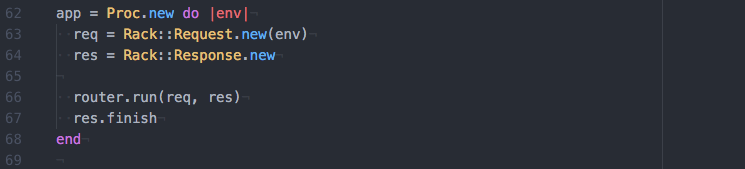
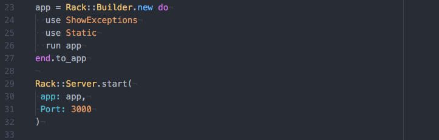
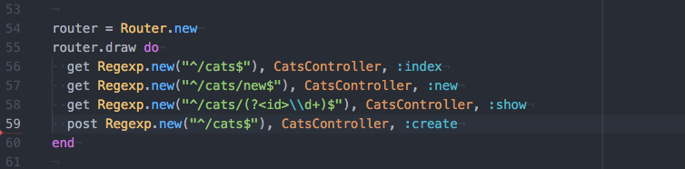
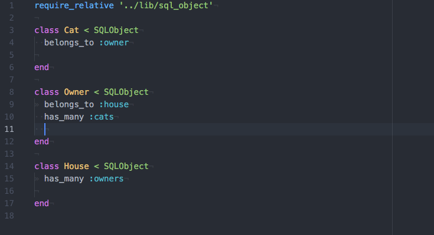
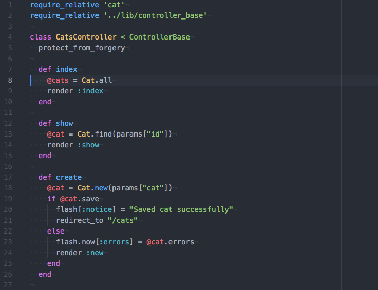
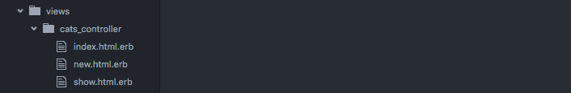
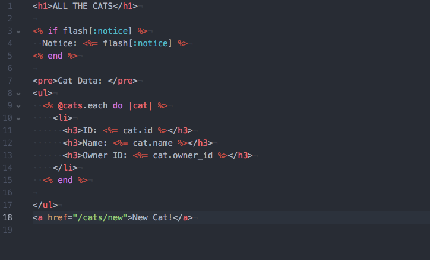
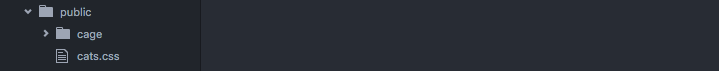

# Pippin

Pippin is a web application development framework written in Ruby, inspired by Rails.  The framework includes a controller base, a router, flash and session cookies, and middleware that display exceptions and serve static files similar to rails.  It also includes Object Relational Modeling similar to ORM that maps to a relational database (sqlite is used in demo).

The below setup up is for an app included in the bin folder that demonstrates how the framework can be set up and used.

## App Setup

This app is built using a simple proc that listens for and responds to requests. It also includes the middleware to serve static files and display exceptions.

```ruby
app = Proc.new do |env|
  req = Rack::Request.new(env)
  res = Rack::Response.new

  router.run(req, res)
  res.finish
end

app = Rack::Builder.new do
  use ShowExceptions
  use Static
  run app
end.to_app

Rack::Server.start(
 app: app,
 Port: 3000
)
```





## Router Setup

The router is used to create RESTful routes using standard HTTP verbs to instantiate and call methods on your controllers.  This is done by requiring the lib/router file and instantiating the router.  Then call the draw method on the router instance and pass in a proc containing routes you want your app to respond to.  The arguments are the HTTP method, the regular expression the route will match, the controller to be instantiated, and the CRUD method to be called on it.



## ORM Setup

The ORM setup is simple. require the lib/sql_object file.  Then have each class inherit from the SQLObject class.  The class name should be the same name as the database table.  If it is not, use the table_name assignment method.  This will give you similar functionality to the Active Record ORM.  You can use the belongs_to, has_many, and has_one_through associations.  Also include various methods that allow you to interact with the underlying database



## Controller Setup

To setup up your controller, require the lib/controller_base file then have your controller class inherit from the ControllerBase class.  Then create methods to respond to various router requests.



## View Setup

To set up views, modify the views folder.  Create folders named after the corresponding controller it will serve views to.  Then create view files and reference them in the render method of the controller. The below example has a cats_controller folder for the CatsController.  The only views supported so far are html, erb templates.  



You can pass data to the views by creating instance variables in the controller methods.  These instance variables will be available in the view template and can be interpolated into the view using ERB templating demonstrated in the sample index view below.



## Static files

Static files you want to serve through your app, whether images or css files, should be placed in the public file.  


